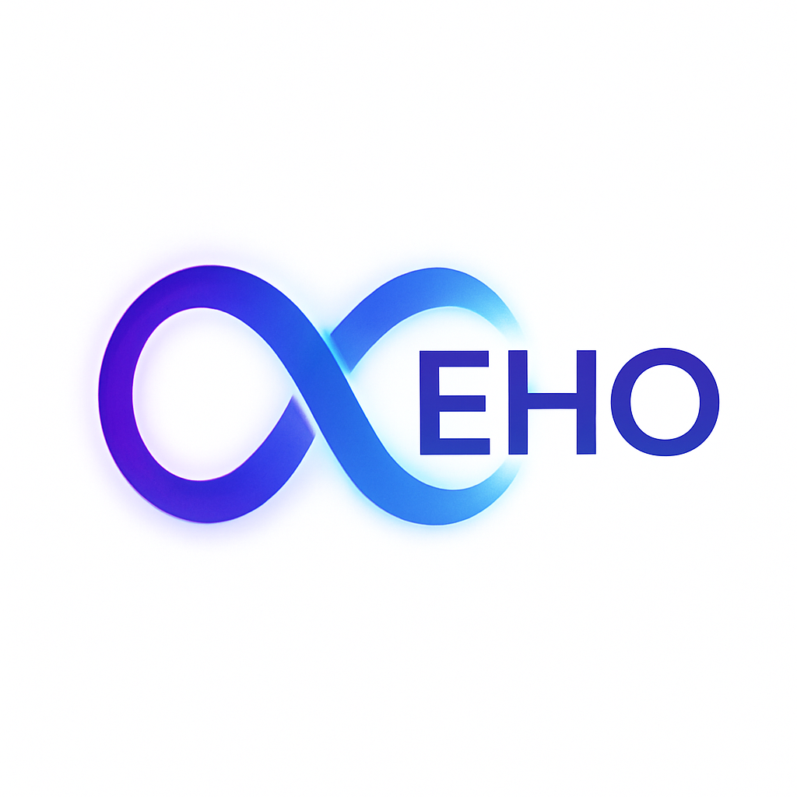

[README.md](https://github.com/user-attachments/files/22110281/README.md)
# Cognitive Echo (\$EHO∞)

**From Insight to Action --- The Architecture of Your Mind**

## 🌌 Overview

Cognitive Echo (\$EHO) is the native token powering **Cognitive Echo**
--- a VR + AI ecosystem where thoughts become **visual**, insights
**resonate**, and cognitive echo transforms **ideas into reality**.

The infinity symbol (∞) represents **infinite resonance** and
**community-driven growth**.

## 📊 Tokenomics

**Total Supply:** 1,000,000,000 EHO (6 decimals)

-   **Presale:** 40% (400,000,000)\
-   **Treasury:** 25% (250,000,000)\
-   **Marketing & Partnerships:** 15% (150,000,000)\
-   **Liquidity:** 10% (100,000,000)\
-   **Team & Advisors:** 10% (100,000,000, vested)

## 🔑 Wallets

-   **Treasury / Marketing Wallet:**
    `neutron16fnch3s625uycn2yszpmvt7r0rt2uy7vvaayrv`\
-   **Liquidity Wallet:**
    `neutron1gpzm7dr7n0wul2fjeuh3ehtnt708h739a30mw0`\
-   **Team & Advisors (vesting later):**
    `neutron1gpzm7dr7n0wul2fjeuh3ehtnt708h739a30mw0`

## 🚀 Vision

Cognitive Echo is not just a token --- it is the **key to the
Cognoverse**.\
- **VR + AI Integration**: visualize your thoughts in real time.\
- **Infinite Resonance**: insights grow stronger with each echo.\
- **Community-Driven**: every holder is part of the architecture.

## 📂 Repository Structure

-   `metadata/token.json` → token parameters (allocations, addresses).\
-   `assets/` → project branding (logos, visuals).\
-   `LICENSE` → MIT License.\
-   `.gitignore` → clean repo setup.

## 📜 License

This project is licensed under the **MIT License**.

------------------------------------------------------------------------

✨ *EHO is the resonance that transforms thoughts into reality. Join the
journey.*
